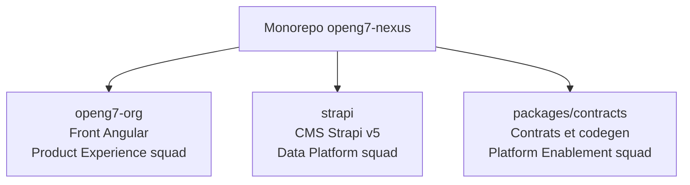

# Guide d'onboarding du monorepo OpenG7

Ce document condense les informations indispensables pour installer les dépendances, démarrer les services clés et identifier les points de contact par workspace. Utilisez-le comme porte d'entrée avant d'explorer la documentation détaillée présente dans `docs/`.

## 1. Pré-requis locaux

- **Node.js LTS** recommandé, avec **Node.js 22** privilégié pour les validations locales récentes.
- **Corepack** activé pour bénéficier de la version de Yarn fournie par le dépôt (`yarn@4.9.4`).
- **PostgreSQL** recommandé : Strapi v5 embarque le driver `pg` et le fichier `.env.example` cible Postgres pour un déploiement multi-pods, mais la configuration `DATABASE_CLIENT=sqlite` reste possible en local si vous souhaitez démarrer sans base externe. Ajustez les variables `DATABASE_*` en fonction du mode choisi.
- Aucune dépendance privée requise : l'installation se fait uniquement via les registres publics NPM.
- **Windows** : le script `install-dev-basics_robuste.ps1` lancé via `Run-Installer-pwsh.cmd` automatise l'installation des pré-requis et propose un menu sur les principales commandes `yarn`.

```bash
corepack enable
yarn --version
```

## 2. Installation des dépendances

1. Cloner le dépôt puis se placer à la racine :

   ```bash
   git clone git@github.com:openg7/openg7-nexus.git
   cd openg7-nexus
   ```

2. Installer les dépendances partagées par les workspaces :

   ```bash
   yarn install
   ```

   > Les modules sont installés en mode `node-modules` via `.yarnrc.yml`.

## 3. Scripts de développement à connaître

| Commande | Rôle |
| --- | --- |
| `yarn dev:web` | Lance l'application Angular (`openg7-org`) avec HMR sur http://localhost:4200. |
| `yarn --cwd openg7-org serve:ssr:openg7-org` | Démarre le serveur SSR Express construit dans `dist/` après `yarn build:preprod`. |
| `yarn dev:cms` | Démarre le workspace Strapi (`@openg7/strapi`) avec rechargement automatique. |
| `yarn dev:all` | Exécute simultanément le front et Strapi via `concurrently`. |
| `yarn --cwd strapi strapi develop` | Optionnel : lance Strapi directement depuis son workspace. |
| `yarn --cwd packages/contracts run codegen` | Régénère les types et clients API à partir des schémas exposés par les workspaces Strapi. |

## 4. Enchaînement recommandé pour lancer les services

1. **Initialiser les variables d'environnement** : copiez les fichiers `.env.example` fournis (`strapi/.env.example`, `openg7-org/.env.example`) puis ajustez les secrets (`STRAPI_ADMIN_*`, `STRAPI_API_READONLY_TOKEN`, `PREVIEW_TOKEN`, etc.).
2. **Démarrer Strapi** :

   ```bash
   yarn dev:cms
   ```

   - Interface admin : http://localhost:1337/admin
   - API REST : http://localhost:1337/api

   > Les seeds (`strapi/src/seed/*`) s'exécutent automatiquement en environnement de développement.

3. **Lancer le front Angular** depuis un nouveau terminal :

   ```bash
   yarn dev:web
   ```

   - Application SSR/CSR : http://localhost:4200
   - Le front consomme par défaut `strapi` via `API_URL` configuré dans `openg7-org/.env`.

   > Pour tester l'exécution SSR côté Node, exécutez `yarn --cwd openg7-org build:preprod` puis `yarn --cwd openg7-org serve:ssr:openg7-org`.

4. **Option tout-en-un** : utilisez `yarn dev:all` si vous souhaitez que le front et Strapi démarrent ensemble.

## 5. Diagramme des workspaces et responsabilités



## 6. Où approfondir ensuite ?

- **Front-end Angular** : `docs/frontend/`
- **Strapi** : `docs/strapi/` et `docs/strapi-workspaces.md`
- **Tooling partagé** : `docs/tooling/`
- **Contrats API** : `packages/contracts/README.md`

Gardez ce guide sous la main lors de l'onboarding : il sert de checklist initiale avant de plonger dans les guides spécialisés.
